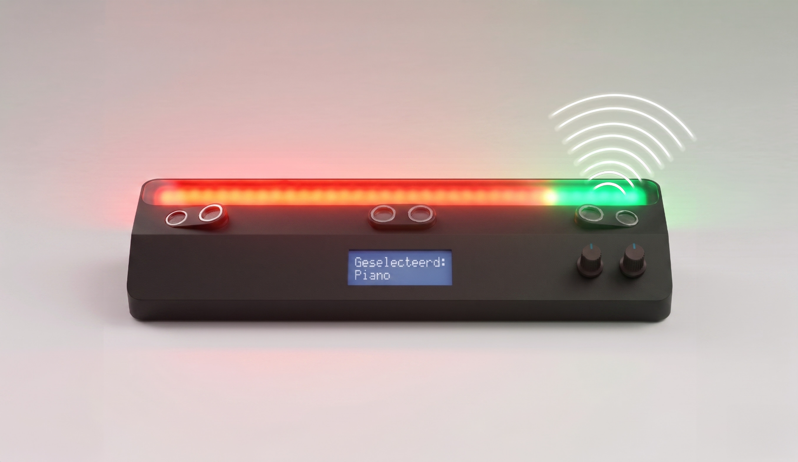
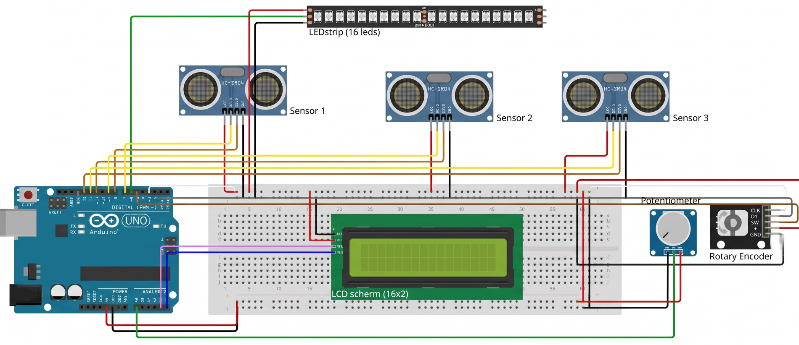
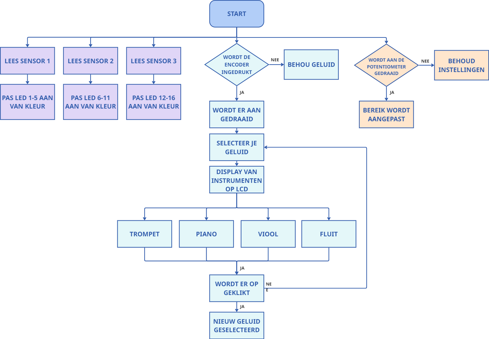
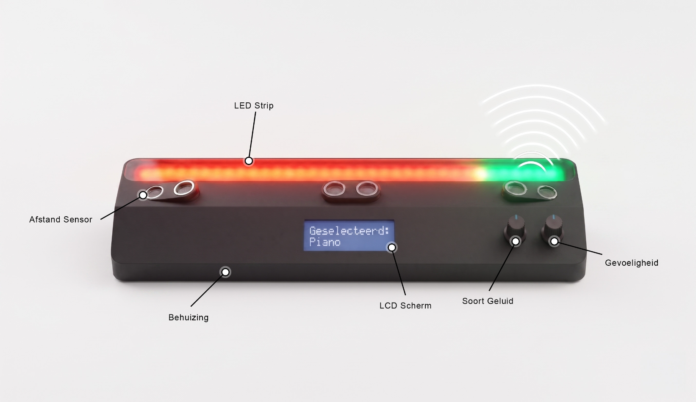
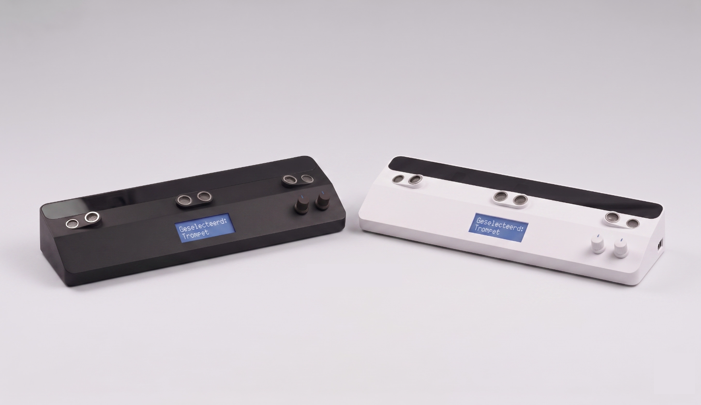

# Touchless Soundboard
## Inleiding
Voor het vak Opkomende Technologieën ontwikkelden we een innovatief, touchless soundboard waarmee je op een intuïtieve en interactieve manier muziek kunt maken. Met behulp van een Arduino Uno, afstandssensoren en eigen code creëren we een systeem waarbij je door handbewegingen in de lucht verschillende tonen kunt bespelen.

De afstand tussen je hand en de sensor bepaalt het geluid. Daardoor kun je op een vloeiende manier variatie en expressie in je muziek brengen. Via een draaiknop kan de gebruiker eenvoudig schakelen tussen verschillende instrumenten uit een ingebouwde bibliotheek, zodat één systeem meerdere muzikale stijlen ondersteunt.

Daarnaast kan de gevoeligheid van de sensoren worden aangepast. Zo kan het instrument volledig worden afgestemd op de voorkeuren van de gebruiker. Dit project combineert hardware en software tot een speelse maar krachtige toepassing waarin technologie en creativiteit samenkomen.

## Contributors
- Raf Machtelinckx
- Rune Vanhoucke

---
## Project

**Product:**
Een soundboard waarmee je zelf geluid en muziek kunt maken met behulp van handbewegingen die door afstandssensoren worden gedetecteerd. Je kunt verschillende tonen kiezen door door de instrumentenbibliotheek te scrollen en de gevoeligheid van de sensoren aan te passen. Een ledstrip geeft aan welke sensor je activeert en met welke intensiteit.

**Doel:**
Gebruikers op een leuke en creatieve manier muziek laten creëeren.

**Uitdaging:**
Door de combinatie te maken met arduino (hardware programmeren) en een python script (software programmeren) leerden we nieuwe paden kennen en gaf het een uitdaging om mee aan de slag te gaan.

### Componenten
Het product bestaat uit een aantal verschillende onderdelen:
- 1× Casing
- 1× Arduino Uno
- 3× HC SR04 ultrasonic distance sensor
- 1× WPI435 Digitale Encoder
- 1× potentiometer
- 1× Breadboard
- 1× LED strip (5V)
- 1× HD44780 1602 LCD-moduledisplaybundel met I2C-interface
- 1× voedingskabel naar computer
- Jumper kabels

### Connectieschema
[Klik hier](fysiek_prototype.md)

### Flowchart

## Codes
### Arduino code 
De Arduino-code leest input uit via de sensoren en regelaars. Vervolgens verwerkt de Arduino deze gegevens en stuurt hij output naar het scherm. Daarnaast geeft hij seriële output door waarmee de Python-code verder kan werken.

[Arduino code](arduino/test_inputs/Sensorcode/Sensorcode.ino)

### Python code
De Python-code verwerkt de seriële output van de Arduino en speelt via de computer geluidsfragmenten af. Deze geluidsfragmenten kunnen vooraf worden ingesteld.

[Python code](arduino/test_outputs/Geluidtest/Geluidtest.py)

## Eindresultaat
### Video
In deze video demonstreren we de Touchless Soundboard. We starten door de Python-code op de pc uit te voeren. De Arduino-code is op dat moment al geüpload naar de Arduino. Daarna kiezen we het gewenste geluid. Vervolgens kalibreren we het bereik van de afstandssensoren naar onze eigen voorkeur. Daarna kan het gebruik van de Touchless Soundboard beginnen.

[Video](https://www.youtube.com/watch?v=dAtlcQHVYiE)

### Renders

